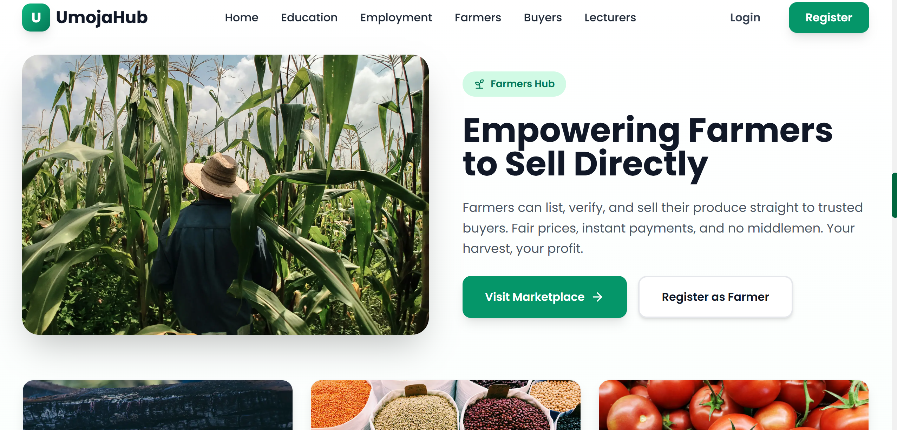

# UmojaHub

UmojaHub is a full stack web platform designed to address three deeply connected challenges in third world countries.

- Food insecurity  
- Limited access to education  
- Youth unemployment  

The platform unifies these problem areas into a single digital ecosystem.

---

## Problem Space

Many communities face the same structural gaps.

- Small scale farmers lack direct access to buyers  
- Learners gain skills with no clear path to income  
- Job seekers struggle to prove ability beyond certificates  
- Existing solutions operate in isolation  

This fragmentation limits real impact.

You cannot fix food insecurity without income.  
You cannot fix unemployment without skills.  
You cannot fix skills without access.

---

## The UmojaHub Approach

UmojaHub treats these challenges as one system.

- One platform  
- One user profile  
- Multiple economic pathways  

A user’s actions in one area strengthen outcomes in another.

Examples.

- A learner earns skills and certificates  
- Skills appear on their profile  
- Employers and project owners can verify them  
- Farmers earn income and build reputation through verified sales  

Everything compounds.

---

## Platform Architecture

UmojaHub is built as a modular system.

Each hub solves a specific problem.  
All hubs share users, data, and trust signals.

---

## Core Modules

### Food Security Hub

Designed to support farmers and buyers.

Farmer capabilities.

- Create and manage crop listings  
- Upload product images  
- Receive and process orders  
- Track order status from pending to completed  
- Submit documents for verification  
- Earn verified farmer badges  

Buyer capabilities.

- Browse verified farmers  
- Filter by location, price, and availability  
- Add items to cart  
- Complete checkout using M-Pesa  
- Track order history  
- Rate completed orders  

This creates trust and transparency in local food markets.

---

### Education Hub

Designed to convert learning into measurable value.

Learner capabilities.

- Browse and enroll in courses  
- Learn through video, text, and quizzes  
- Track progress with completion percentages  
- Earn downloadable certificates  
- Skills automatically attach to profile  

Admin capabilities.

- Create and manage courses  
- Control publishing workflow  

Learning outcomes are visible and reusable across the platform.

---

### Employment Hub

Designed to bridge skills and opportunity.

User capabilities.

- Browse and post jobs  
- Apply using profile and certificates  
- Track application status  
- Join collaborative projects  
- Match opportunities based on verified skills  

Employers see proof.  
Applicants show real work.

---

## Cross Platform Features

Shared across all modules.

- Unified user profile  
- Role based dashboards  
- Verified badges  
- Cross hub skill recommendations  
- Secure authentication  
- Route level access control  

No duplicated data.  
No isolated workflows.

---

## User Roles

Supported roles.

- Farmer  
- Buyer  
- Student  
- Learner  
- Lecturer  
- Admin  

Each role has scoped permissions and a dedicated dashboard.

---

## Tech Stack

Frontend.

- Next.js 15  
- TypeScript  
- Tailwind CSS  

Backend.

- Next.js API routes  
- LowDB  
- NextAuth.js  
- bcrypt  

Integrations.

- M-Pesa payments  
- Email verification  
- File uploads  

The stack prioritizes speed, simplicity, and iteration.

---

## Admin Capabilities

Implemented.

- User verification workflow  
- Farmer approval and rejection  
- Badge assignment  
- Basic user management  

In progress.

- Content moderation  
- Analytics dashboards  
- Audit logs  

Admins act as trust enforcers across the system.

---

## Project Status

- MVP is approximately 75 percent complete  
- All core hubs are functional  
- Payments and order workflows work end to end  
- Certificate generation is live  

The focus has been real user flows over mock features.

---

## Roadmap

Short term focus.

- In app notifications  
- Email notifications  
- Admin analytics dashboard  
- Content moderation tools  

Mid term.

- Offline support  
- PWA setup  
- Performance optimization  

Long term.

- End to end testing  
- Accessibility improvements  
- Scalability planning  

---

------

## Screenshots

### The farmers section on the landing page

This view allows farmers to manage crop listings, track orders, and monitor verification status.


---

## Local Development

Clone the repository.

```bash
https://github.com/loopystack19/silver-disco
cd silver-disco
